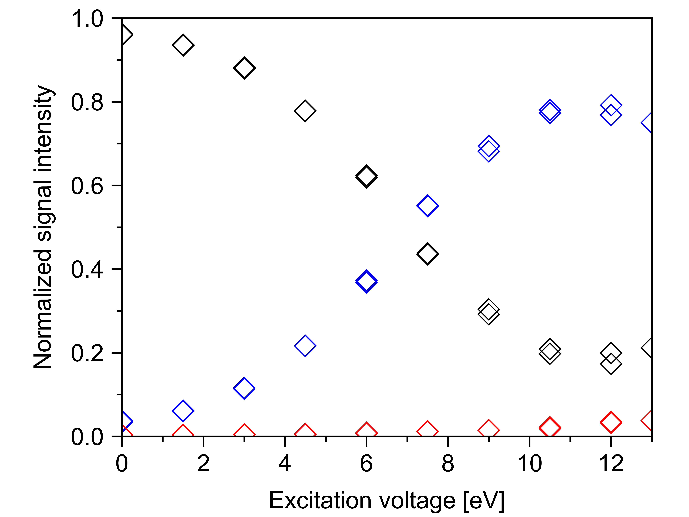

# 1-Visualization & Plotting with Matplotlib

## Format Graphics Origin Style
{ align=left }
```python
    from matplotlib import rcParams, cycler
    import matplotlib.pyplot as plt
    from matplotlib.ticker import AutoMinorLocator


    rcParams['font.family'] = 'sans-serif'
    rcParams['font.sans-serif'] = ['Arial']
    rcParams['font.size'] = 16
    rcParams['axes.linewidth'] = 1.1
    rcParams['axes.labelpad'] = 10.0
    plot_color_cycle = cycler('color', ['000000', '0000FE', 'FE0000', '008001', 'FD8000', '8c564b', 
                                        'e377c2', '7f7f7f', 'bcbd22', '17becf'])
    rcParams['axes.prop_cycle'] = plot_color_cycle
    rcParams['axes.xmargin'] = 0
    rcParams['axes.ymargin'] = 0
    rcParams.update({"figure.figsize" : (6.4,4.8),
                     "figure.subplot.left" : 0.177, "figure.subplot.right" : 0.946,
                     "figure.subplot.bottom" : 0.156, "figure.subplot.top" : 0.965,
                     "axes.autolimit_mode" : "round_numbers",
                     "xtick.major.size"     : 7,
                     "xtick.minor.size"     : 3.5,
                     "xtick.major.width"    : 1.1,
                     "xtick.minor.width"    : 1.1,
                     "xtick.major.pad"      : 5,
                     "xtick.minor.visible" : True,
                     "ytick.major.size"     : 7,
                     "ytick.minor.size"     : 3.5,
                     "ytick.major.width"    : 1.1,
                     "ytick.minor.width"    : 1.1,
                     "ytick.major.pad"      : 5,
                     "ytick.minor.visible" : True,
                     "lines.markersize" : 10,
                     "lines.markerfacecolor" : "none",
                     "lines.markeredgewidth"  : 0.8})


    for ion in range(1, output_array_size_x):
        plt.plot(output_array[:,0], output_array[:,ion], marker='D', ls="none")
    plt.xlim(0, 13)
    plt.ylim(0, None)
    plt.ylabel('Normalized signal intensity')
    plt.xlabel('Excitation voltage [eV]')
    plt.gca().xaxis.set_minor_locator(AutoMinorLocator(n=2))
    plt.gca().yaxis.set_minor_locator(AutoMinorLocator(n=2))
    plt.savefig("out.png", dpi=1000)
    plt.show()
```

## Plot with two different scales

Two plots on the same axes with different left and right scales.

The trick is to use *two different axes* that share the same *x* axis.
You can use separate `matplotlib.ticker` formatters and locators as
desired since the two axes are independent.

Such axes are generated by calling the `.Axes.twinx` method. Likewise,
`.Axes.twiny` is available to generate axes that share a *y* axis but
have different top and bottom scales.
```python
import numpy as np
import matplotlib.pyplot as plt

# Create some mock data
t = np.arange(0.01, 10.0, 0.01)
data1 = np.exp(t)
data2 = np.sin(2 * np.pi * t)

fig, ax1 = plt.subplots()

color = 'tab:red'
ax1.set_xlabel('time (s)')
ax1.set_ylabel('exp', color=color)
ax1.plot(t, data1, color=color)
ax1.tick_params(axis='y', labelcolor=color)

ax2 = ax1.twinx()  # instantiate a second axes that shares the same x-axis

color = 'tab:blue'
ax2.set_ylabel('sin', color=color)  # we already handled the x-label with ax1
ax2.plot(t, data2, color=color)
ax2.tick_params(axis='y', labelcolor=color)

fig.tight_layout()  # otherwise the right y-label is slightly clipped
plt.show()
```

??? info "References"
    - `matplotlib.axes.Axes.twinx` / `matplotlib.pyplot.twinx`
    - `matplotlib.axes.Axes.twiny` / `matplotlib.pyplot.twiny`
    - `matplotlib.axes.Axes.tick_params` / `matplotlib.pyplot.tick_params`
