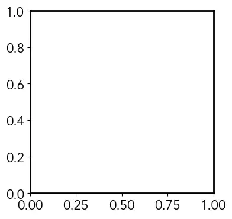
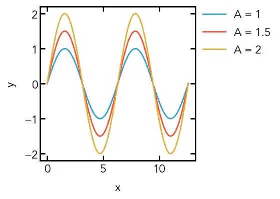

# 2-MatPlotLib Style Guide

## Creating and using an `.mplstyle` file
First, we must create a file called your\_style.mplstyle which we can then edit with the text editor of your choice. I am going to build upon the scientific theme of my first article, so we will create a style called scientific.mplstyle. To run this style, we must place it in our matplotlib configuration directory. An easy way to check for where this is to run the following code:
```python
import matplotlib as mpl
mpl.get_configdir()
```
My configuration directory, which is likely similar for most is found as a subfolder of my home directory: `~/.matplotlib/`
We place our `.mplstyle` file in a subdirectory called `stylelib`. If this folder doesn’t yet exist for you, can create it and put your `scientific.mplstyle` file into this folder. Now, when you want to use your style, use the following line in your Python script:

```python
plt.style.use('scientific')
```

## Figure Properties
First, we can set the figure size, which is normally 6.4 x 4.8 inches. We will use a 4 x 4 inch figure as our default. Now, every time we call plt.figure(), our figure will have dimensions of 4 x 4:
```python
# Figure Properties
figure.figsize: 4, 4
```

Now we can set our font and the default font size. I will use the font ‘Avenir’ and a font size of 16.
```python
# Font Properties
font.family: Avenir
font.size: 16
```
## Axes Properties
Now that we have changed the global figure properties, let’s edit properties of the axes/subplot objects. First, we want to change the thickness of the axes, which we do using `axes.linewidth`:

```python
# Axes properties
axes.linewidth: 2
```

Next, I often find that the default padding (whitespace) between the tick labels and the axis labels are too small. We can insert our own custom value of padding with the following:
```
axes.labelpad: 10
```

Finally, we will change the default colors that are used when plotting, which can done by editing the color cycler. We do this by creating a `cycler()` object and passing it to the property `axes.prop_cycle`. I quite like the colors used in plots on FiveThirtyEight, so will use this as our color cycler. I will be inserting the colors using their HEX codes:
```python
axes.prop_cycle: cycler(color=['008fd5', 
                               'fc4f30', 
                               'e5ae38',
                               '6d904f',
                               '8b8b8b',
                               '810f7c'])
```

Let’s inspect our progress so far! We use the following code:

```python
# Import packages
import matplotlib.pyplot as plt
# Use our custom style
plt.style.use('scientific')
# Create figure
fig = plt.figure()
# Add subplot to figure
ax = fig.add_subplot(111)
# Show empty plot
plt.show()
```



## Tick Properties
We notice from the default plot that the tick marks are pointed outwards, and there are no ticks on the top or right axes. For our scientific theme, we want the ticks to all point inwards, and we want ticks on all of the axes, which we can do with the following:
```python
# Tick properties
# x-axis
xtick.top: True
xtick.direction: in
# y-axis
ytick.right: True
ytick.direction: in
```

Now, we want to change the two properties `size` and `width`. The value of width corresponds to the linewidth, so we will set this equal to the value we gave for axes.linewidth (2). The value of size is the length of the ticks — we will set major ticks to have a size of 7 and minor ticks to have a size of 5:

```python
# x-axis
xtick.major.size: 7
xtick.major.width: 2
xtick.minor.size: 5
xtick.minor.width: 2
# y-axis
ytick.major.size: 7
ytick.major.width: 2
ytick.minor.size: 5
ytick.minor.width: 2
```

## Line Properties
If we want to edit any of the default parameters that are used when we make a call to `plt.plot()` we can do so by editing the properties for lines. This can be extended to other plotting functions — for example, you can edit properties for scatter to affect the default parameters when creating a scatter plot. In our case, I am only going to the change the default width of the lines to 2, from their default value of 1.5:
```python
# Lines properties
lines.linewidth: 2
Legend Properties
The default legend in matplotlib is semi-transparent and has a frame with curved corners called a FancyBox. To see this in action we can run the following code, with all the default parameters:
# Import packages
import matplotlib.pyplot as plt
import numpy as np
# Create figure
fig = plt.figure()
# Add subplot to figure
ax = fig.add_subplot(111)
# Create some data
x = np.linspace(0, 4*np.pi, 200)
y1 = np.sin(x)
y2 = 1.5*np.sin(x)
y3 = 2*np.sin(x)
# Plot data
ax.plot(x, y1, label='A = 1')
ax.plot(x, y2, label='A = 1.5')
ax.plot(x, y3, label='A = 2')
# Add legend
ax.legend()
# Show plot
plt.show()
```
Let’s make the legend fully opaque and remove the frame altogether:

```python
# Legend properties
legend.framealpha: 1
legend.frameon: False
```

## Final Results
Now, let’s see how the previous plot looks with our new matplotlib style! We use the following code:

### Stylesheet
```python
# Figure properties
figure.figsize: 4, 4

# Font properties
font.family: Avenir
font.size: 16

# Axes properties
axes.linewidth: 2
axes.labelpad: 10
axes.prop_cycle: cycler(color=['008fd5', 'fc4f30', 'e5ae38', '6d904f', '8b8b8b', '810f7c'])

# Tick properties
# x-axis
xtick.top: True
xtick.direction: in
xtick.major.size: 7
xtick.major.width: 2
xtick.minor.size: 5
xtick.minor.width: 2

# y-axis
ytick.right: True
ytick.direction: in
ytick.major.size: 7
ytick.major.width: 2
ytick.minor.size: 5
ytick.minor.width: 2

# Line properties
lines.linewidth: 2

# Legend properties
legend.framealpha: 1
legend.frameon: False
```

### Demo Graph

```python
# Import packages
import matplotlib.pyplot as plt
import numpy as np
# Use our custom style
plt.style.use('scientific')
# Create figure
fig = plt.figure()
# Add subplot to figure
ax = fig.add_subplot(111)
# Create some data
x = np.linspace(0, 4*np.pi, 200)
y1 = np.sin(x)
y2 = 1.5*np.sin(x)
y3 = 2*np.sin(x)
# Plot data
ax.plot(x, y1, label='A = 1')
ax.plot(x, y2, label='A = 1.5')
ax.plot(x, y3, label='A = 2')
# Set axis labels
ax.set_xlabel('x')
ax.set_ylabel('y')
# Add legend - loc is a tuple specifying the bottom left corner
ax.legend(loc=(1.02, 0.65))
# Save plot
plt.show()
```

