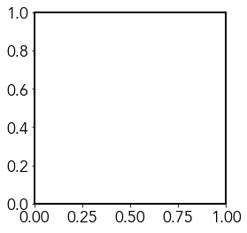

# Intro Scientific plotting

## Importing Packages


```python
# Import required packages
%matplotlib inline
import matplotlib as mpl
import matplotlib.pyplot as plt
import numpy as np
from pylab import cm
```

## Loading Data


```python
# Use numpy.loadtxt to import our data
wavelength, samp_1_abs, samp_2_abs = np.loadtxt('Absorbance_Data.csv', unpack=True, delimiter=',', skiprows=1)
```

## Plotting Our Data


```python
# Create figure and add axes object
fig = plt.figure()
ax = fig.add_axes([0, 0, 1, 1])

# Plot and show our data
ax.plot(wavelength, samp_1_abs)
ax.plot(wavelength, samp_2_abs)
plt.show()
```


    

    


## Fonts


```python
import matplotlib.font_manager as fm

# Collect all the font names available to matplotlib
font_names = [f.name for f in fm.fontManager.ttflist]
print(font_names)
```

    ['STIXSizeFourSym', 'DejaVu Sans Mono', 'cmr10', 'DejaVu Sans Mono', 'DejaVu Serif', 'STIXSizeFiveSym', 'STIXNonUnicode', 'STIXSizeFourSym', 'STIXSizeTwoSym', 'STIXGeneral', 'DejaVu Serif', 'cmmi10', 'DejaVu Sans Mono', 'cmtt10', 'cmex10', 'cmsy10', 'STIXGeneral', 'STIXGeneral', 'DejaVu Sans', 'STIXNonUnicode', 'STIXSizeThreeSym', 'DejaVu Serif', 'STIXSizeThreeSym', 'STIXSizeOneSym', 'STIXNonUnicode', 'STIXGeneral', 'cmss10', 'STIXSizeTwoSym', 'DejaVu Sans', 'DejaVu Sans Mono', 'cmb10', 'STIXSizeOneSym', 'STIXNonUnicode', 'DejaVu Serif', 'DejaVu Sans', 'DejaVu Serif Display', 'DejaVu Sans', 'DejaVu Sans Display', 'Didot', 'Silom', 'Luxi Mono', 'Luxi Mono', 'Raanana', 'Arial Black', '.SF NS Display Condensed', 'Bitstream Vera Serif', 'Hiragino Maru Gothic Pro', 'Chalkboard', 'Kohinoor Telugu', 'Bitstream Vera Sans Mono', 'Ayuthaya', 'Bradley Hand', 'Bitstream Vera Sans Mono', 'Courier New', 'Lao MN', 'System Font', 'Avenir Next Condensed', 'Beirut', '.SF Compact Display', 'Phosphate', 'Serto Batnan', '.SF NS Rounded', 'Snell Roundhand', 'Serto Jerusalem', 'PT Mono', '.SF NS Display Condensed', 'Luxi Mono', 'STIXSizeOneSym', 'Serto Jerusalem Outline', 'Luxi Serif', '.SF NS Symbols', '.SF NS Text Condensed', 'Estrangelo TurAbdin', 'Myriad Pro', 'Hiragino Sans', 'Georgia', 'Estrangelo Nisibin Outline', 'Al Tarikh', 'Goha-Tibeb Zemen', 'Sinhala Sangam MN', 'System Font', 'Gujarati Sangam MN', 'Hoefler Text', '.SF NS Symbols', 'Farah', 'Estrangelo Quenneshrin', 'Verdana', 'Charter', 'Luxi Sans', 'Webdings', '.Aqua Kana', 'Myriad Pro', 'Verdana', 'Herculanum', 'Marion', 'InaiMathi', 'Bitstream Vera Sans Mono', 'Luxi Sans', 'Goha-Tibeb Zemen', 'Serto Jerusalem', '.SF Compact Text', 'KufiStandardGK', '.Arabic UI Display', 'Serto Jerusalem', 'Bitstream Vera Sans Mono', 'Courier New', 'Serto Urhoy', '.SF NS Display Condensed', 'Sukhumvit Set', 'Arial Rounded MT Bold', 'Zapf Dingbats', 'Apple Braille', 'Myriad Pro', 'Comic Sans MS', '.SF NS Display Condensed', '.SF Compact Text', 'Trebuchet MS', 'Lao Sangam MN', 'STIXSizeThreeSym', 'Bitstream Vera Sans', 'Luxi Sans', 'STIXSizeThreeSym', 'STIXSizeFourSym', 'Wingdings', 'Bitstream Vera Sans', 'Arial', 'System Font', 'Diwan Kufi', 'Arial Unicode MS', 'Bitstream Vera Sans', 'STIXSizeFiveSym', 'STIXGeneral', '.SF Compact Text', 'Devanagari Sangam MN', 'Serto Mardin', 'Serto Kharput', 'Hiragino Sans', 'Baskerville', 'Apple Chancery', 'Bodoni 72 Smallcaps', 'Brush Script MT', 'Tahoma', 'Kohinoor Bangla', 'Malayalam Sangam MN', 'Kohinoor Devanagari', 'Hiragino Sans', 'Bangla Sangam MN', '.SF Compact Rounded', 'Verdana', 'Serto Mardin', 'PT Sans', '.SF Compact Display', 'Palatino', 'Estrangelo Nisibin', 'Estrangelo Talada', '.SF Compact Display', 'Telugu MN', '.SF Compact Text', 'DIN Condensed', 'Iowan Old Style', '.SF Compact Rounded', 'Hiragino Sans', 'Estrangelo Edessa', 'Mishafi Gold', 'Optima', 'Luxi Serif', 'Arial Narrow', '.SF Compact Text', 'Songti SC', 'Apple Braille', 'Arial', '.SF Compact Text', 'Hiragino Sans', 'Luxi Mono', 'Superclarendon', 'Courier New', 'Gurmukhi MN', 'Symbol', 'STIXIntegralsUpD', 'STIXSizeTwoSym', 'Tamil Sangam MN', 'System Font', '.SF NS Symbols', '.SF Compact Text', '.SF Compact Rounded', 'Sinhala MN', 'System Font', 'Helvetica Neue', 'Arial Narrow', '.SF NS Symbols', 'Myriad Pro', 'Kefa', 'Heiti TC', 'Luxi Serif', 'East Syriac Ctesiphon', 'Hoefler Text', 'Serto Malankara', 'Apple SD Gothic Neo', 'Hiragino Sans', 'Noto Nastaliq Urdu', 'Arial', 'STIXIntegralsUpSm', 'Waseem', 'SignPainter', 'STIXVariants', 'STIXGeneral', 'AppleMyungjo', '.SF Compact Display', 'Serto Batnan', 'System Font', '.SF Compact Text', 'Tahoma', 'STIXIntegralsSm', '.SF Compact Rounded', 'Luxi Sans', '.SF NS Display Condensed', '.SF NS Text Condensed', 'Estrangelo Midyat', 'Myanmar Sangam MN', 'Helvetica', '.LastResort', 'PT Serif Caption', 'Damascus', 'Hiragino Sans', 'Lucida Grande', 'Diwan Thuluth', 'Bodoni Ornaments', 'Papyrus', 'Estrangelo Antioch', 'Luxi Serif', 'STIXSizeOneSym', 'System Font', 'Bitstream Vera Serif', 'Georgia', 'New Peninim MT', 'Muna', '.SF NS Symbols', '.SF Compact Rounded', '.SF NS Display Condensed', 'System Font', '.SF Compact Text', 'Oriya MN', 'Wingdings 2', 'Apple Braille', 'Gurmukhi MT', 'Serto Urhoy', 'PT Serif', 'Courier New', 'GFS Neohellenic', 'Apple Braille', 'Plantagenet Cherokee', 'Krungthep', '.SF Compact Rounded', 'System Font', '.SF NS Symbols', '.SF Compact Text', 'East Syriac Adiabene', 'Khmer Sangam MN', 'Kokonor', 'STIXIntegralsD', 'Thonburi', 'STIXIntegralsUpSm', 'Trebuchet MS', '.SF NS Display Condensed', 'Farisi', 'Avenir', 'Hiragino Mincho ProN', '.SF Compact Display', 'Tamil MN', '.SF Compact Text', 'Hiragino Sans', 'Trattatello', 'Noteworthy', 'Gurmukhi Sangam MN', 'STIXNonUnicode', 'ITF Devanagari', 'DecoType Naskh', 'STIXSizeFourSym', 'Luminari', 'STIXNonUnicode', 'Mishafi', 'AppleGothic', 'Product Sans', 'Menlo', '.SF NS Symbols', 'Bitstream Vera Sans', 'Futura', 'Skia', '.SF Compact Rounded', 'Al Nile', 'System Font', 'Heiti TC', 'Bangla MN', 'System Font', 'System Font', 'DIN Alternate', '.SF Compact Display', 'Myriad Pro', 'Rockwell', 'Devanagari MT', 'STIXIntegralsUpD', 'American Typewriter', 'Georgia', 'STIXVariants', 'Kannada MN', 'Baghdad', 'Arial', 'Myanmar MN', 'Chalkduster', 'Shree Devanagari 714', 'STIXNonUnicode', 'Arial Narrow', 'Microsoft Sans Serif', '.SF NS Text Condensed', 'Verdana', 'STIXIntegralsSm', 'Trebuchet MS', 'Myriad Pro', 'Times New Roman', 'Arial Hebrew', 'Copperplate', '.SF NS Symbols', 'Big Caslon', '.SF Compact Display', '.SF Compact Display', 'PingFang HK', 'Telugu Sangam MN', 'Product Sans', 'Marker Felt', 'Myriad Pro', 'Sana', 'Apple Braille', '.Arabic UI Text', 'Al Bayan', '.SF Compact Display', 'Avenir Next', '.SF Compact Rounded', 'STIXIntegralsD', 'STIXSizeTwoSym', 'Mshtakan', 'Euphemia UCAS', 'Gill Sans', 'Sathu', 'Geeza Pro', 'Hiragino Sans', 'Arial Narrow', 'Myriad Pro', 'Comic Sans MS', 'Athelas', 'Malayalam MN', 'STIXIntegralsUp', 'Bodoni 72', 'Times New Roman', 'Savoye LET', 'STIXNonUnicode', 'Corsiva Hebrew', 'Hiragino Sans GB', 'Oriya Sangam MN', '.SF NS Text Condensed', 'Myriad Pro', '.SF Compact Text', 'Bodoni 72 Oldstyle', 'STIXIntegralsUp', '.SF NS Text Condensed', 'Georgia', 'Nadeem', 'Khmer MN', 'Gujarati MT', '.Keyboard', '.SF NS Display Condensed', '.SF NS Symbols', 'Times New Roman', 'Trebuchet MS', 'Myriad Pro', 'Times', 'Kannada Sangam MN', 'Wingdings 3', 'Andale Mono', 'STIXGeneral', 'Impact', 'System Font', '.SF NS Text Condensed', 'Product Sans', 'Zapfino', '.SF NS Display Condensed', 'Cochin', 'Kailasa', 'STIXGeneral', 'Apple Symbols', 'Times New Roman', 'Seravek', 'Chalkboard SE', 'System Font', '.SF Compact Rounded', '.Helvetica Neue DeskInterface', 'System Font', 'System Font', 'Hiragino Sans']


## General Plot Parameters


```python
# Edit the font, font size, and axes width
mpl.rcParams['font.family'] = 'Avenir'
plt.rcParams['font.size'] = 18
plt.rcParams['axes.linewidth'] = 2
```

## Generate Set of Colors


```python
# Generate 2 colors from the 'Set1' colormap
colors = cm.get_cmap('tab10', 2)
```

## Create Figure and Axes


```python
# Create figure object and store it in a variable called 'fig'
fig = plt.figure(figsize=(3, 3))

# Add axes object to our figure that takes up entire figure
ax = fig.add_axes([0, 0, 1, 1])

plt.show()
```


    

    


### Multiple Axis Panels


```python
# Create figure object and store it in a variable called 'fig'
fig = plt.figure(figsize=(3, 3))

# Add two axes objects to create a paneled figure
ax1 = fig.add_axes([0, 0, 1, 0.4])
ax2 = fig.add_axes([0, 0.6, 1, 0.4])

plt.show()
```


    

    


### Axis Insets


```python
# Create figure object and store it in a variable called 'fig'
fig = plt.figure(figsize=(3, 3))

# Add two axes objects to create an inset figure
ax1 = fig.add_axes([0, 0, 1, 1])
ax2 = fig.add_axes([0.5, 0.5, 0.4, 0.4])

plt.show()
```


    

    


### Removing Spines


```python
# Create figure object and store it in a variable called 'fig'
fig = plt.figure(figsize=(3, 3))

# Add axes object to our figure that takes up entire figure
ax = fig.add_axes([0, 0, 1, 1])

# Hide the top and right spines of the axis
ax.spines['right'].set_visible(False)
ax.spines['top'].set_visible(False)

plt.show()
```


    

    


## Final Edited Plot

### Function to Convert Energy to Wavelength


```python
# Function to convert energy (eV) to wavelength (nm)
def E_to_WL(E):
    return [1240/i for i in E]
```

### Plotting Script


```python
# Create figure object and store it in a variable called 'fig'
fig = plt.figure(figsize=(3, 3))

# Add axes object to our figure that takes up entire figure
ax = fig.add_axes([0, 0, 1, 1])

# Create new axes object by cloning the y-axis of the first plot
ax2 = ax.twiny()

# Edit the major and minor ticks of the x and y axes
ax.xaxis.set_tick_params(which='major', size=10, width=2, direction='in')
ax.xaxis.set_tick_params(which='minor', size=7, width=2, direction='in')
ax.yaxis.set_tick_params(which='major', size=10, width=2, direction='in', right='on')
ax.yaxis.set_tick_params(which='minor', size=7, width=2, direction='in', right='on')

# Edit the tick parameters of the energy x-axis
ax2.xaxis.set_tick_params(which='major', size=10, width=2, direction='in')
ax2.xaxis.set_tick_params(which='minor', size=7, width=2, direction='in')

# Plot the two sample absorbances, using previously generated colors
ax.plot(wavelength, samp_1_abs, linewidth=2, color=colors(0), label='Sample 1')
ax.plot(wavelength, samp_2_abs, linewidth=2, color=colors(1), label='Sample 2')

# Edit the major and minor tick locations of x and y axes
ax.xaxis.set_major_locator(mpl.ticker.MultipleLocator(100))
ax.xaxis.set_minor_locator(mpl.ticker.MultipleLocator(50))
ax.yaxis.set_major_locator(mpl.ticker.MultipleLocator(0.5))
ax.yaxis.set_minor_locator(mpl.ticker.MultipleLocator(0.25))

# Add ticks manually to energy axis
ax2.xaxis.set_major_locator(mpl.ticker.FixedLocator(E_to_WL(np.linspace(1.5, 3.0, 4))))
ax2.xaxis.set_minor_locator(mpl.ticker.FixedLocator(E_to_WL(np.linspace(1.4, 3.2, 19))))

# Add tick labels manually to energy axis
ax2.set_xticklabels(['1.5', '2.0', '2.5', '3.0'])

# Add the x and y-axis labels
ax.set_xlabel(r'$\mathregular{\lambda}$ (nm)', labelpad=10)
ax.set_ylabel('Absorbance (O.D.)', labelpad=10)

# Add energy axis label
ax2.set_xlabel('Energy (eV)', labelpad=10)

# Set the axis limits
ax.set_xlim(370, 930)
ax.set_ylim(-0.2, 2.2)

# Set the energy axis limits
ax2.set_xlim(370, 930)

# Add legend to plot
ax.legend(bbox_to_anchor=(1, 1), loc=1, frameon=False, fontsize=16)

# Save figure
plt.savefig('Final_Plot.png', dpi=300, transparent=False, bbox_inches='tight')

# Show figure
plt.show()
```


    

    

!!! note
    Source: https://github.com/venkatesannaveen/python-science-tutorial/
